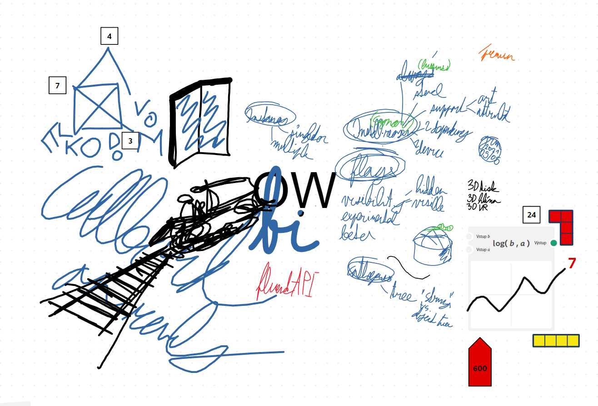

# ♾️ Open whiteboard initiative

OWBI is an initiative for standardizing the way how digital whiteboards exchange data.

This is proposal of version 🍂 `1.0.0` created by [Pavol Hejný](https://pavolhejny.com), co-author of [online whiteboard Collboard](https://collboard.com).

## 🐱‍👤 HackPrague

This proposal is implemented with [multiple sample applications](/applications)) during the [HackPrague](https://www.hackprague.com/hackathon2021) hackathon. See the video:

https://youtu.be/PWjKxIvIOQM

## 🚵 Roadmap

We want to be able to scrape data from every tool, but time is limited. Here is a list of our priorities and progress:

-   ▰▰▰▰ PNG, JPG, SVG images
-   ▰▰▰▱ Collboard
-   ▰▰▱▱ FigJam
-   ▰▱▱▱ Microsoft whiteboard
-   ▰▱▱▱ Google Jamboard
-   ▰▱▱▱ Google draw
-   ▰▱▱▱ PDFs
-   ▰▱▱▱ DOC(X), DOCX(X)
-   ▱▱▱▱ AWWApp
-   ▱▱▱▱ SeeSaw
-   ▱▱▱▱ ZiteBoard
-   ▱▱▱▱ Miro
-   ▱▱▱▱ OpenBoard
-   ▱▱▱▱ Trello
-   ▰▱▱▱ Any online tool

_Note: We will be happy to receive ideas & pull requests._

# 📝 Whitepaper

Our goal is to capture all **essential features of the whiteboards**. They at the first glance seem to be similar to images or documents but they are specific.

-   Enable to extend the format with new features specific to each platform but still be able to use some basic common features
-   Support for infinitely large whiteboards
-   Support of both vector and raster graphics
-   Keep information on who and when created the board
-   Preserve history
-   Decentralize & distribute the storage of the whiteboards

## 📁 File for offline use

We [describe here](/applications/file-parser/src/WhiteboardFile.ts) `.OWB` file extension as universal whiteboard format.

<!--TODO: Describe it-->

## 🔗 API for real-time interaction

We describe here the protocol for real-time communication & federation between users and whiteboards.
This is implemented by Socket.io API and [Superface OneSDK](https://superface.ai/).
